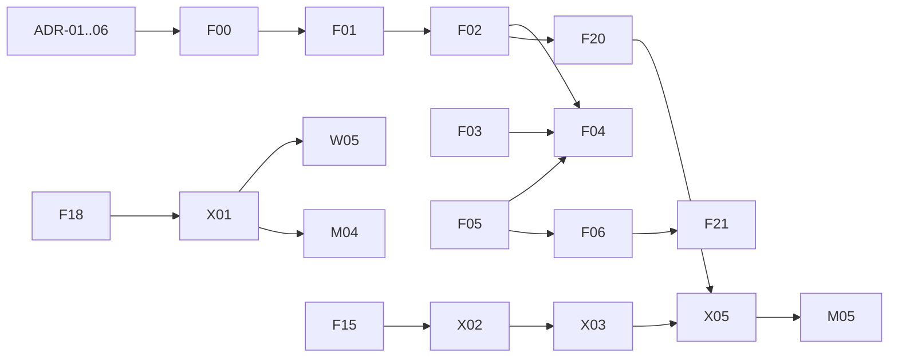

# 03-orchestration / dependency-dag-and-waves.md

**The build order for all ~48 features.** This is the file the Orchestrator reads to answer one question repeatedly: *"given what is `Done` on disk right now, which features may I dispatch next?"* It defines the wave ladders (Program 1: Waves 0–5; Program 2: P0–P4), the critical path, the full dependency DAG as machine-parseable adjacency tables, the cross-program sync points, and the exact selection algorithm.

Companion files: `agent-roster.md` (who builds), `quality-gates.md` (how a feature becomes `Done`), `04-git-strategy.md` (promotion order within a wave), `05-tracking/status/*.json` (live state — the truth this file is read against).

---

## The ADR gate (precedes every feature)

**No feature branch forks until the ADR(s) it depends on are locked.** The Architect authors ADR-01..06 in Phase 0 (Wave 0). Dependencies on ADRs are as binding as dependencies on features:

| ADR | Locked before | Blocks these features |
|---|---|---|
| ADR-01 Schema contract | any of F01,F02,F04,F05,F11,F23,F25,W04,M04 | schema-touching features |
| ADR-02 Tool-module convention | any tool-adding feature (F00 retrofit included) | all tool-adders |
| ADR-03 Transform interface | F10 (then F09,F25,W05,M04) | transform layer |
| ADR-04 Metrics measure-model | F14 (then F16,F17,F20,F24,X05) | metrics/observability/monitors |
| ADR-05 Vault vs app-connections | F13, X06 | vault/cookie features |
| ADR-06 Registry cross-repo contract | all of Program 2 | platform↔engine boundary |

A feature whose ADR is not yet locked is **not dispatchable**, even if its feature-deps are `Done`.

---

## Program 1 wave ladder (engine, F00–F25)

| Wave | Features | Theme |
|---|---|---|
| **0** | ADR-01..06 + **F00** | Contracts locked; app-connections landed through the full gate pipeline (clears the biggest `index.ts` contention before Wave 1). |
| **1** | **F01**, F05, F03, F14, F19 | Schema contract, agent-native authoring, nightly re-verify, metrics 2.0, close items 4/5. |
| **2** | **F02**, F10, F16, F22, F23 | Drift detection, transform layer, result cache, semantic discovery, golden snapshots. |
| **3** | **F04**, F06, F07, F08, F11, F15 | Self-healing, computer-use crystallization, pipelines, CEL branching, provenance, static-http. |
| **4** | F09, F12, F13, F17, F20 | Bidirectional flows, policy engine, credential vault, OTel, change-monitoring mesh. |
| **5** | F18, F21, F24, F25 | Ephemeral hosted endpoint, NL→template one-shot, marketplace reputation, OpenAPI export. |

## Program 2 wave ladder (platform, W/X/M)

| Wave | Features | Theme |
|---|---|---|
| **P0** | W01, W02, X07, X02-spike | Monorepo scaffold, cross-surface design system, registry mirror DB, Chromium-in-Sandbox feasibility spike. |
| **P1** | W03, W04, W07, X01, X02, X07, M01, M02 | Registry browser + detail, auth/accounts, execution gateway + safe runtime, Expo scaffold + mobile design system. |
| **P2** | W05, W06, W08, X03, X04, X06, M03, M04 | Web run console, contribute flow, landing hero, durable jobs, results delivery, encrypted cookies, mobile browse + run. |
| **P3** | X05, M05, M06 | Monitors service + push-on-change (the killer feature), mobile monitors + account. |
| **P4** | M07 | App-store prep (EAS submit; store fees are a later owner step). |

---

## Cross-program synchronization

Program 2 depends on Program 1 through the registry + published types (ADR-06), not through source:

- **P0 runs in parallel with engine Waves 1–2.** W01/W02/X07 and the X02 feasibility spike need nothing from the engine yet — the Program-2 pod starts as soon as the Orchestrator reaches engine Wave 1.
- **The "run community APIs" core waits on the engine.** X01/X02 productize **F18** (hosted-exec substrate) and consume **F15** (static-http, the cloud-friendly kind) + **F03** (nightly-verified registry). So X01/X02 → hence W05/M04 → cannot complete until F18/F15/F03 are `Done` (engine Waves 1 & 3).
- **Monitors chain across repos:** F02 (Wave 2) → F20 (Wave 4) → **X05** (P3) → **M05** (P3). The mobile push-on-change monitor is the deepest cross-program path.
- **Schema for result views:** F01 (Wave 1) → W04/M04 result rendering.

**Sync rule for the Orchestrator:** a Program-2 feature listing an `F##` dependency is only dispatchable once that `F##` is `Done` *and merged to the engine repo's `integration`* (published-type availability, per ADR-06) — not merely code-complete in a worktree.

---

## Critical path

```
ADR-01..06  →  F00  →  F01  →  F02  →  F04            (engine spine; F04 also needs F03 + F05)
                                  │
                        F03 ──────┤
                        F05 ──────┘
Secondary spine:  F05  →  F06  →  F21
Platform spine:   F18  →  X01/X02  →  W05 / M04  →  (X03 → X05 → M05 monitors)
```

F04 (self-healing) is the convergence point of the engine's reliability pillar: it needs F02 (drift), F03 (nightly verify), and F05 (agent-native authoring) all `Done`. Protect this path — slippage here delays Wave 3+ across the board.



---

## Full dependency DAG — blockers (what each feature waits on)

Legend: `ADR-n` = architecture decision; `registry`/`exec`/`action-seq`/`item-5` = existing repo capabilities that must be present (all satisfied by the current codebase except where noted). `—` = no blocker.

### Program 1 (engine)

| Feature | Blocked by | Wave |
|---|---|---|
| F00 | — | 0 |
| F01 | ADR-01 | 1 |
| F02 | F01 | 2 |
| F03 | registry | 1 |
| F04 | F02, F03, F05 | 3 |
| F05 | ADR-01 | 1 |
| F06 | F05 | 3 |
| F07 | exec | 3 |
| F08 | action-seq | 3 |
| F09 | F07, F10 | 4 |
| F10 | ADR-03 | 2 |
| F11 | F01 | 3 |
| F12 | — | 4 |
| F13 | F00, ADR-05 | 4 |
| F14 | ADR-04 | 1 |
| F15 | — | 3 |
| F16 | F14, ADR-04 | 2 |
| F17 | F14 | 4 |
| F18 | F11, registry | 5 |
| F19 | (F03) | 1 |
| F20 | F02 | 4 |
| F21 | F05, F06 | 5 |
| F22 | — | 2 |
| F23 | F01 | 2 |
| F24 | F03, F14 | 5 |
| F25 | F01, F07 | 5 |

### Program 2 (platform)

| Feature | Blocked by | Wave |
|---|---|---|
| W01 | — | P0 |
| W02 | W01 | P0 |
| W03 | W01, W02, X07 | P1 |
| W04 | W03, F01 | P1 |
| W05 | W04, X01, X04 | P2 |
| W06 | W03, registry | P2 |
| W07 | W01 | P1 |
| W08 | W02, X01 | P2 |
| X01 | F18 | P1 |
| X02 | F18, F15, item-5 | P1 |
| X03 | X02 | P2 |
| X04 | X01 | P2 |
| X05 | X03, F02/F20 | P3 |
| X06 | F13, ADR-05 | P2 |
| X07 | registry | P1 |
| M01 | W01, W02 | P1 |
| M02 | W02, M01 | P1 |
| M03 | M02, X07 | P2 |
| M04 | M03, X01, X04 | P2 |
| M05 | M04, X05 | P3 |
| M06 | M04, X06 | P3 |
| M07 | M01–M06 | P4 |

---

## Reverse DAG — unblocks (what completing a feature releases)

Used by the Orchestrator to know which features to re-check the moment one goes `Done`. Only non-trivial fan-out edges shown.

| Completing… | …unblocks |
|---|---|
| ADR-01 | F01, F05, F11, F23 |
| ADR-03 | F10 |
| ADR-04 | F14 |
| ADR-05 | F13, X06 |
| ADR-06 | all of Program 2's cross-repo consumption |
| F00 | F13 |
| F01 | F02, F11, F23, F25, W04, M04 |
| F02 | F04, F20 |
| F03 | F04, F24 |
| F05 | F04, F06 |
| F06 | F21 |
| F07 | F09, F25 |
| F10 | F09 |
| F11 | F18 |
| F14 | F16, F17, F24 |
| F15 | X02 |
| F18 | X01, X02 |
| F20 | X05 |
| W01 | W02, W03, W07, M01 |
| W02 | W03, W08, M01, M02 |
| X01 | W05, W08, X04, M04 |
| X04 | W05, M04 |
| X07 | W03, M03 |
| X05 | M05 |
| X06 | M06 |

---

## Next-unblocked selection algorithm (Orchestrator)

Run whenever a feature reaches `Done` or a wave opens. Purely disk-driven — no memory of prior runs needed.

```
1. Load 05-tracking/tracker-data.json (static: deps, waves) and every 05-tracking/status/*.json (live).
2. Determine the CURRENT open wave per program:
     the lowest-numbered wave that still has a non-Done feature.
   (Waves may overlap at the boundary: a next-wave feature whose deps are all Done
    is dispatchable even if a straggler remains in the current wave — deps, not wave
    number, are the hard gate. Wave numbers order PROMOTION, deps order DISPATCH.)
3. A feature <ID> is DISPATCHABLE iff ALL of:
     a. its status is Todo (not In-Prog / In-Review / Blocked / Done),
     b. status.owner is empty  (claims registry — see agent-roster.md),
     c. every ADR in its blocker list is locked,
     d. every feature in its blocker list is Done
        (and, for a Program-2 feature depending on F##, that F## is merged to the
         engine repo's integration — published-type availability, ADR-06),
     e. dispatching it respects the builder cap:
          - <=3 Engine Builders concurrently (burst 4 only if the wave is
            low-contention on types.ts/engine.ts/index.ts),
          - Program-2 pod (Web/Mobile/Cloud) counts separately from Engine Builders.
4. Among dispatchable features, prefer CRITICAL-PATH ones first
   (F00→F01→F02→F04; F18→X01/X02; F02→F20→X05→M05) so dependents can rebase onto them.
5. Claim (write owner) and dispatch a fresh subagent per selected feature (context-bounded-workflow.md).
6. On any feature going Done, re-run from step 1 (consult the reverse-DAG table to know what just opened).
```

**Wave numbers vs deps — the distinction that matters:** wave numbers set the **promotion** cadence (what the Integration agent merges together and what the Deployment agent ships as a coherent set at G8). The **dependency DAG** sets the **dispatch** eligibility. A feature is never dispatched before its deps regardless of wave; but a feature *may* start slightly ahead of its nominal wave if its deps happen to finish early and a builder is free — that is a feature, not a violation.

---

## Promotion order within a wave (ties to git-strategy)

Within a wave, the Integration agent merges **critical-path / foundation features first** so dependents rebase onto them and inherit their `types.ts`/`index.ts` shape:

- Wave 1: F01 before F05/F03/F14/F19 (F01 owns the schema type others reference).
- Wave 2: F02 before F10/F16/F22/F23 (F02's diff primitive is reused by F20; F16 needs F14 already promoted).
- Wave 3: F15 and F11 early (X02/F18 consumers); F04 lands after F02/F03/F05 are on `integration`.
- P1: X07 (mirror) and X01 (gateway) before the browse/run features that call them.

See `04-git-strategy.md` for the branch/rebase mechanics; `index.ts`/`types.ts` conflicts are resolved by the Integration agent via ADR-02 append-only.
