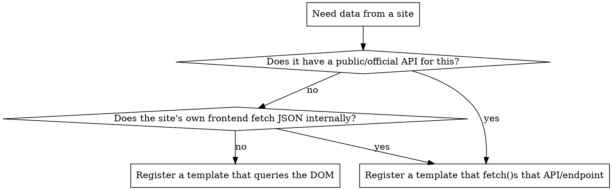

# Using APImeMCP

## Overview

apimemcp is a "compiler pattern" MCP server: you register a small piece of logic once
per domain, then re-run it deterministically. There are two kinds of template:

- **Extraction** (`register_extraction_template` → `execute_native_extraction`): a
  JavaScript script run inside a real, isolated Playwright/Chromium context via
  `page.evaluate()`. The script can do DOM queries, or just `fetch()` a JSON endpoint
  directly if one exists — "extraction script" means "any JS that returns
  JSON-serializable data from inside the page." Returns the scraped data.
- **Action-sequence** (created by the recorder Chrome extension, not a tool): a
  recorded browser workflow — click, fill, navigate, submit — replayed step by step.
  For *doing* a task (log in, post, submit a form), not scraping. Registered by the
  extension POSTing to the server's `/api/recordings`; run the same way via
  `execute_native_extraction` with its `templateId`.

Every registered template is simultaneously three things: an MCP tool call, a plain
HTTP endpoint (`POST http://127.0.0.1:3000/api/run/<id>`), and a uniquely-named
standalone script (`apis/<id>.mjs`, only needs Playwright — no server/repo). Each
also gets an auto-generated console guide (`apis/<id>.md`, rendered at `/docs/<id>`).

## Before writing any script: check for a real API first

Scraping a rendered DOM is the fallback, not the default. Many sites you'd think to
scrape already expose the data as JSON to their own frontend.



To check the middle branch empirically (don't guess): load the target page with
`chromium.launch()` + `page.on('response', ...)`, filter for `content-type: json`,
and look at what the page itself requests. A five-line probe script beats
DOM-scraping every time it finds something — fewer moving parts, survives site
redesigns, gets fields the DOM never renders (exact prices, dimensions, etc.).

This determines *how* the script works, not *whether* to use apimemcp — either way
the result gets registered as a normal template. Building infrastructure to defeat
rate limits, auth walls, or ToS on a specific target is a separate, real decision —
apply the same judgment here you'd apply to writing that code by hand.

## Tools (exact signatures)

| Tool | Input | Notes |
|---|---|---|
| `register_extraction_template` | `templateId` (kebab-case), `domainPattern`, `executableScript`, `fixedTargetUrl?`, `waitStrategy?`, `readySelector?`, `outputSchema?` | Upserts by `templateId`. `outputSchema` is a JSON Schema contract for result `data`; omitted templates retain pre-contract behavior. Multiple templates can share a `domainPattern` (N:1) — always pass explicit `templateId` when more than one template targets the same domain, auto-match-by-URL is only reliable for a domain's single most-recently-registered template. Set `fixedTargetUrl` when the page never varies (see below). Default wait is the fast `domcontentloaded` — if a page populates its data asynchronously (a grid that loads after initial paint), set `waitStrategy: 'networkidle'` or, better, `readySelector` naming the element that signals "data's here." |
| `execute_native_extraction` | `targetUrl?`, `templateId?`, `proxyUrl?`, `cookieString?`, `connectionId?`, `executableScript?`, `outputSchema?`, `snapshot?` | Runs an extraction OR an action-sequence template. A non-empty `executableScript` makes a dry-run that bypasses template lookup and all storage persistence; templates with `outputSchema` return `schemaValidation: { valid, errors? }`, otherwise it is absent. Set `snapshot: "record"` to save a local golden result or `snapshot: "check"` to receive `match`, `regression` with path-level diffs, or `no-baseline`; omitted/default `snapshot: "off"` preserves normal behavior. Prefer a connected `connectionId` for login state; it uses a persistent browser profile and cannot be combined with manual cookie input. Logs a metric on success. |
| `synthesize_schema` | `targetUrl`, `cookieString?`, `proxyUrl?` | Renders an unmapped page and returns raw HTML plus a screenshot path. Write a script from those forensics, dry-run it with `execute_native_extraction({ targetUrl, executableScript })`, then register it normally. |
| `connect_app` | `connectionId`, `domainPattern`, `loginUrl`, `autoStart?` | Opens a visible persistent Chromium profile for user-driven login. Use one profile per site; call `confirm_app_connection` after login. The tool uses injected dependencies and stores browser-profile metadata only, never secret values. |
| `confirm_app_connection` | `connectionId` | Marks the user-managed browser profile ready for extraction. |
| `list_app_connections` | none | Lists profile IDs, domain scopes, startup behavior, and confirmation status without returning cookie values. |
| `save_template_cookies` | `templateId`, `cookieString` | Persist session cookies for a template **without running it** — use this when the user mentions/shares cookies in chat so they land in the dashboard. |
| `add_community_template` | `domain` | Pulls a pre-verified template from the public [apimemcp-templates](https://github.com/NeetigyaShah/APImeMCP-Templates) registry (a plain git repo, no server) and registers it locally — check this **before** writing a new template by hand for a well-known site; someone may have already contributed one. Registry templates run with a network allowlist (own domain + a small CDN allowlist) enforced automatically. |
| `registry CI` | `apimemcp add <domain>` | The CLI uses the same community-template path as MCP. Registry contributions require a declared network allowlist, are linted in CI, and have live network behavior checked nightly. |
| `discover_templates` | `domain`, `limit?`, `source?` | Searches local templates and/or the community registry with explainable lexical scores. Call this before synthesizing or recording a template; use `source: 'local'` when network access is unavailable. |
| `request_template_heal` | `templateId` | Captures a local heal ticket for a fixed-target template: DOM snapshot path, screenshot path, console errors, old script, drift diff, and output schema. Use when drift/schema validation indicates a template broke. |
| `submit_template_heal` | `templateId`, `ticketId`, `newScript`, `notes?` | Dry-runs the proposed script and validates it against the template's `outputSchema`; opens a registry PR branch only when valid. Invalid submissions keep the ticket pending and create no branch/PR. |
| `list_pending_heals` | none | Lists heal-ticket summaries `{id, templateId, status, createdAt}` without forensic blobs or script text. Use this after nightly self-heal or after a rejected submission. |
| `batch_download_assets` | `urls: string[]`, `outputDir` | Concurrency-limited (5 at a time). Use for "download the images" rather than a hand-rolled fetch loop. |
| `schedule_stock_check` | `targetUrl`, `cronExpression` (5-field only), `templateId?` | Persists across restarts. |
| `get_extraction_stats` | none | Totals, recent domains, last run — read this instead of re-deriving from raw files. |
| `send_notification` | `endpointUrl`, `message` | Generic webhook POST. |

| `register_pipeline` | `pipelineId`, `name`, `description?`, `steps` | Saves a sequential chain of registered templates; map fields with `$init.path` or `stepId.path`. |
| `run_pipeline` | `pipelineId`, `initialInput?` | Runs the chain fail-fast and returns ordered step results plus pipeline metrics. |
| `list_pipelines` | none | Lists registered pipelines and step counts. |

Action-sequence templates are **created by the recorder extension** (it POSTs recorded
steps + cookies to `/api/recordings`), not by a tool — there's no "register workflow"
tool. You run them via `execute_native_extraction`.

Resource `status://server` and dashboard `http://127.0.0.1:3000` (if running) expose
the same data for inspection — check `status://server` before assuming the browser
isn't ready.

Successful extraction results are transparently reused within the server's
short in-process cache. The cache is isolated by template, URL, cookie identity,
and proxy, and never applies to action-sequence templates; no agent-facing API
change is needed.

## Discover before authoring

Before creating a template for a domain or task, call `discover_templates` with a
natural-language query such as `{ domain: 'SEC EDGAR filing alerts' }`. Each result
includes an explainable `score` and `matchedOn` fields. Use a high-confidence local
hit directly; use a registry hit to decide whether `add_community_template` can
reuse it. This read-only lookup never opens a browser or reads cookies.

## What this server can do (capabilities)

- **Extraction APIs** — register a per-domain script, run it deterministically; returns JSON.
- **Recorded workflow replay** — a Chrome extension records real clicks/typing/navigation,
  compiles them to an action-sequence template that replays headlessly (login, post, submit).
- **Watch mode** — action-sequence templates can run in a visible browser window
  (dashboard "Watch" button, or HTTP `{"headful":true}`) so you can see them execute.
- **Logged-in runs + saved cookies** — supply `cookieString` (via the tool or the
  dashboard cookie box); it's saved per template, and the dashboard shows a "Use saved
  cookies" button to re-run without re-pasting.
- **Batch image download** — `batch_download_assets`, or the standalone script's
  `--download` flag which saves every image URL in a result to a folder.
- **Every template is portable** — also reachable as an HTTP endpoint and as a
  standalone `apis/<id>.mjs` (only needs Playwright), each with a generated docs page
  at `/docs/<id>`.
- **Scheduling, metrics, notifications** — cron re-runs, run stats, webhook pings.
- **Self-healing handoff** — drifted fixed-target templates can produce local forensics tickets; a calling agent supplies the fix, APImeMCP dry-runs/schema-validates it, and the registry client opens a PR branch. The server never calls an LLM for the fix and never auto-merges.

## Connected app profiles

Prefer `connect_app` for sites that need login. The user signs in once in a
visible browser window; the profile is reused across runs and can auto-open when
the server starts. The server never asks the agent to copy cookie values.

## Templates with no per-run input ("fixed-target")

Fixed-target community templates are re-verified nightly; their Shields endpoint
badge is published at `badges/<templateId>.json` in the templates registry.

Some requests don't have a URL that varies per call — "get me today's top deals on
Amazon" always hits the same deals page; there's nothing for a caller to supply.
Register those with `fixedTargetUrl` set to that one page, and call
`execute_native_extraction` with just `templateId` — no `targetUrl`. The dashboard
marks these with a ★ badge instead of a URL input, so they're visually distinct
from templates that need a per-call target. Don't ask the caller for a URL a
fixed-target template doesn't need.

## Defaults — don't ask, just pick these unless told otherwise

- **Deliverable shape:** a plain JSON result (via `execute_native_extraction`'s
  return value, or files on disk from `batch_download_assets`). Do not build a web
  viewer/UI unless the user asks for one to *look at* something — most requests to
  "make an API for X" want data, not a page.
- **Images:** if the extracted data includes image URLs and the request is
  data-oriented ("get me all the X"), download them with `batch_download_assets`
  into a clearly-named folder rather than only returning URLs — a folder of files
  is a more complete answer than a list of links the user then has to fetch
  themselves.
- **Auth/API keys:** this is the one thing you genuinely can't decide yourself —
  if the best path needs a key (e.g., a first-party API that requires one), ask for
  it once, don't substitute scraping to avoid asking.
- **Cookies mentioned in chat:** when the user shares session cookies for a site,
  persist them to the relevant template with `save_template_cookies` (or pass
  `cookieString` when running) so they show up in the dashboard's saved-cookies store
  — don't use them once and drop them.

## Verify empirically before committing to a script

Every one of these was a real bug hit while building and using this server —
guessed instead of checked, cost a rewrite:

- Pagination style (click-through vs. infinite scroll) — different sites do both;
  a quick live probe (scroll, check if item count changes) settles it in seconds.
- Whether a field (e.g. price) actually renders for an anonymous session — some
  data is login-gated; check the live DOM/response before assuming a selector is
  wrong.
- The exact request shape of a discovered JSON endpoint (query params, headers) —
  capture it from a real `page.on('response')` listener, don't hand-guess the URL.
- Whether the default `waitStrategy` (`domcontentloaded`) is enough — confirmed live:
  a real production template returned 0 items under the fast default because its grid
  populates asynchronously, and 395 once re-registered with `waitStrategy: 'networkidle'`.
  If a fresh template returns empty/partial data on the first real run, this is the
  first thing to check, before assuming the extraction script itself is wrong.

Write one small probe (fetch or DOM query, console.log the shape), confirm it
matches expectations, *then* register the real template. Skipping the probe is the
single most common source of a wrong-on-first-try template.

## Common mistakes

- Treating "make an API for X" as "must use apimemcp" even when X has its own
  public API that's faster and more reliable — see decision flowchart above.
- Registering a second template for a domain that already has one and expecting
  the first to still auto-match by URL (it won't — pass explicit `templateId`).
- Building a full dashboard/viewer page when the user just wanted data back.

## Transforms

Use the optional `transform` field on `register_extraction_template` to normalize
returned `data`. Preview a candidate spec with `preview_transform` before attaching it.

```json
{
  "version": 1,
  "ops": [
    { "op": "rename", "from": "raw_price", "to": "price" },
    { "op": "coerce", "field": "price", "to": "number" },
    { "op": "pick", "fields": ["name", "price"] }
  ]
}
```

Operations run in order. `pick` keeps named fields, `rename` changes one key,
`coerce` supports `string`, `number`, `boolean`, and ISO-8601 `date`, and `map`
applies `pick`/`rename`/`coerce` to each array element. Malformed specs and failed
coercions are reported as catchable tool errors.
