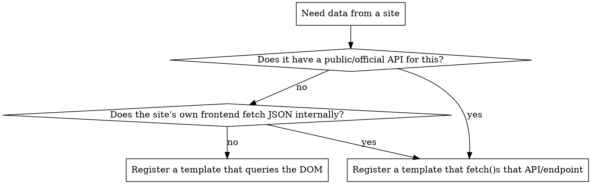

# Using APImeMCP

## Overview

apimemcp is a "compiler pattern" MCP server: you register a small JavaScript
extraction script once per domain (`register_extraction_template`), then re-run it
deterministically against matching URLs (`execute_native_extraction`). It runs the
script inside a real, isolated Playwright/Chromium context via `page.evaluate()` —
the script can do DOM queries, or just `fetch()` a JSON endpoint directly if one
exists. It is not limited to DOM scraping; "extraction script" means "any JS that
returns JSON-serializable data from inside the page."

## Before writing any script: check for a real API first

Scraping a rendered DOM is the fallback, not the default. Many sites you'd think to
scrape already expose the data as JSON to their own frontend.

To check the middle branch empirically (don't guess): load the target page with
`chromium.launch()` + `page.on('response', ...)`, filter for `content-type: json`,
and look at what the page itself requests. A five-line probe script beats
DOM-scraping every time it finds something — fewer moving parts, survives site
redesigns, gets fields the DOM never renders (exact prices, dimensions, etc.).

This determines *how* the script works, not *whether* to use apimemcp — either way
the result gets registered as a normal template. Building infrastructure to defeat
rate limits, auth walls, or ToS on a specific target is a separate, real decision —
apply the same judgment here you'd apply to writing that code by hand.

## Tools (exact signatures)

| Tool | Input | Notes |
|---|---|---|
| `register_extraction_template` | `templateId` (kebab-case), `domainPattern`, `executableScript`, `fixedTargetUrl?` | Upserts by `templateId`. Multiple templates can share a `domainPattern` (N:1) — always pass explicit `templateId` when more than one template targets the same domain, auto-match-by-URL is only reliable for a domain's single most-recently-registered template. Set `fixedTargetUrl` when the page never varies (see below). |
| `execute_native_extraction` | `targetUrl?`, `templateId?`, `proxyUrl?` | `targetUrl` is only optional when `templateId` names a template registered with `fixedTargetUrl`. Logs a metric automatically on success. |
| `batch_download_assets` | `urls: string[]`, `outputDir` | Concurrency-limited (5 at a time). Use this for "download the images" rather than writing your own fetch loop. |
| `schedule_stock_check` | `targetUrl`, `cronExpression` (5-field only), `templateId?` | Persists across restarts. |
| `get_extraction_stats` | none | Totals, recent domains, last run — read this instead of re-deriving from raw files. |
| `send_notification` | `endpointUrl`, `message` | Generic webhook POST. |

Resource `status://server` and dashboard `http://127.0.0.1:3000` (if running) expose
the same data for inspection — check `status://server` before assuming the browser
isn't ready.

## Templates with no per-run input ("fixed-target")

Some requests don't have a URL that varies per call — "get me today's top deals on
Amazon" always hits the same deals page; there's nothing for a caller to supply.
Register those with `fixedTargetUrl` set to that one page, and call
`execute_native_extraction` with just `templateId` — no `targetUrl`. The dashboard
marks these with a ★ badge instead of a URL input, so they're visually distinct
from templates that need a per-call target. Don't ask the caller for a URL a
fixed-target template doesn't need.

## Defaults — don't ask, just pick these unless told otherwise

- **Deliverable shape:** a plain JSON result (via `execute_native_extraction`'s
  return value, or files on disk from `batch_download_assets`). Do not build a web
  viewer/UI unless the user asks for one to *look at* something — most requests to
  "make an API for X" want data, not a page.
- **Images:** if the extracted data includes image URLs and the request is
  data-oriented ("get me all the X"), download them with `batch_download_assets`
  into a clearly-named folder rather than only returning URLs — a folder of files
  is a more complete answer than a list of links the user then has to fetch
  themselves.
- **Auth/API keys:** this is the one thing you genuinely can't decide yourself —
  if the best path needs a key (e.g., a first-party API that requires one), ask for
  it once, don't substitute scraping to avoid asking.

## Verify empirically before committing to a script

Every one of these was a real bug hit while building and using this server —
guessed instead of checked, cost a rewrite:

- Pagination style (click-through vs. infinite scroll) — different sites do both;
  a quick live probe (scroll, check if item count changes) settles it in seconds.
- Whether a field (e.g. price) actually renders for an anonymous session — some
  data is login-gated; check the live DOM/response before assuming a selector is
  wrong.
- The exact request shape of a discovered JSON endpoint (query params, headers) —
  capture it from a real `page.on('response')` listener, don't hand-guess the URL.

Write one small probe (fetch or DOM query, console.log the shape), confirm it
matches expectations, *then* register the real template. Skipping the probe is the
single most common source of a wrong-on-first-try template.

## Common mistakes

- Treating "make an API for X" as "must use apimemcp" even when X has its own
  public API that's faster and more reliable — see decision flowchart above.
- Registering a second template for a domain that already has one and expecting
  the first to still auto-match by URL (it won't — pass explicit `templateId`).
- Building a full dashboard/viewer page when the user just wanted data back.
